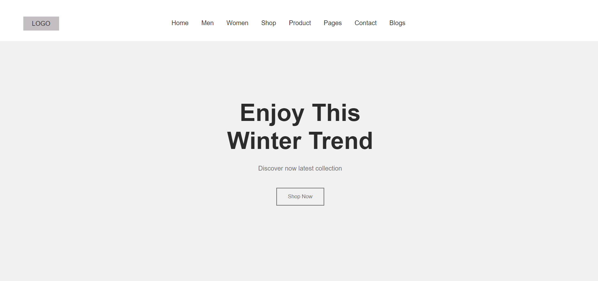
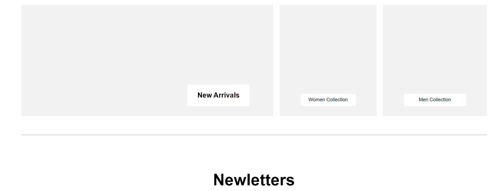

# Minimalist Home Page

This is a web application that displays information about countries from an Api. It was built with css grid and REACT

## Table of contents

- [Overview](#overview)
  - [Screenshot](#screenshot)
  - [Link](#link)
  - [Built with](#built-with)

## Overview
This is a simple homepage of a clothing business. It has the nav bar, hero section, collections section and the newletters section. It was built with HTML and CSS.

### Screenshot

### Link
- Live Site URL: (https://minimalist-homepage.vercel.app/)

### Built with

- HTML and CSS
